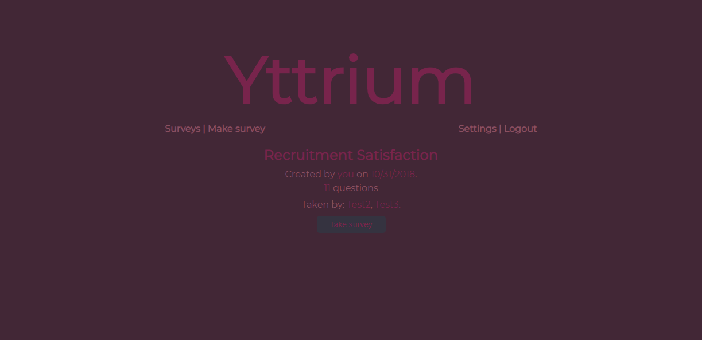

# Yttrium

Yttrium is an Express / React / MongoDB web application for creating and taking surveys and review of the response.

Project name comes from the periodic table of elements: Y, atomic number 39.

## Setup 

1. Run `npm install` in 'backend' directory.

2. Create a 'config.js' file in 'backend' directory; see 'config-sample.js' for reference.

3. Run `npm install` in 'frontend' directory.

4. Create a '.env' file in 'frontend' directory; see '.env-sample' for reference.

5. Run a MongoDB server and setup the datastore by running `mongo < db_init.js` in 'datastore' directory.

6. Run the backend server using `npm start` in 'backend' directory.

7. Run `npm run build` in 'frontend' directory and set up a server to statically serve the generated 'build' directory. Alternatively, run `npm start` in frontend directory to start a development server.

## Usage

Navigate to the frontend server index location, which is http://localhost:3000 when using `npm start`.

A survey consists of one or several questions, each of which can either be of open or closed type. Only authenticated users can view, take and create surveys. A survey can be edited or deleted by its creator only if it has not already been taken by someone.

There are a few sample users and surveys in the datastore created per setup procedure, valid credentials are Test# / Test#, where # is 1 up to 4. In the create / edit survey control questions can be rearranged by drag-and-drop, the same goes for closed-type question options - the user needs to drag the bullet or the empty space on the right of the input field as the event does not work on the input field itself.

## Implementation

Express.js backend server, React / Redux frontend.